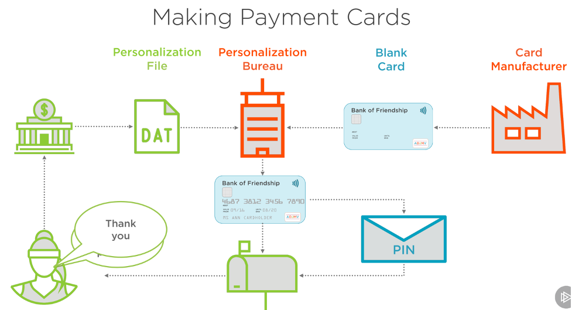
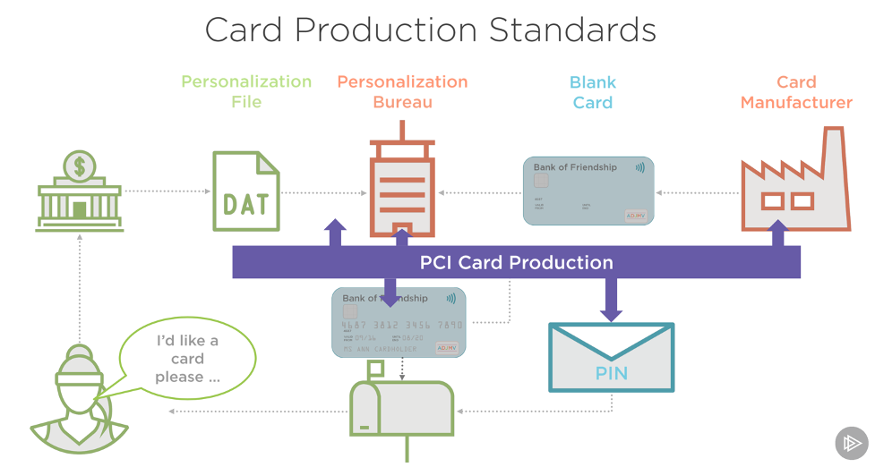
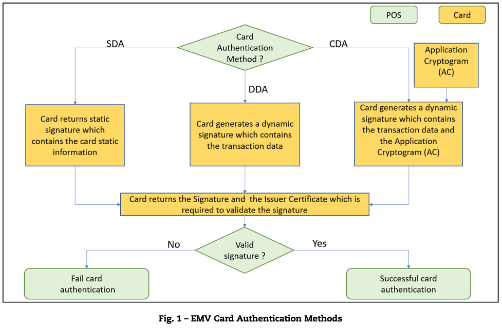
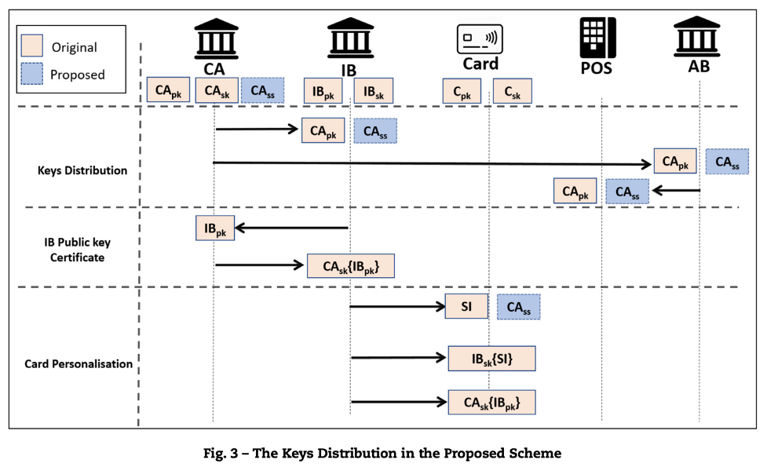
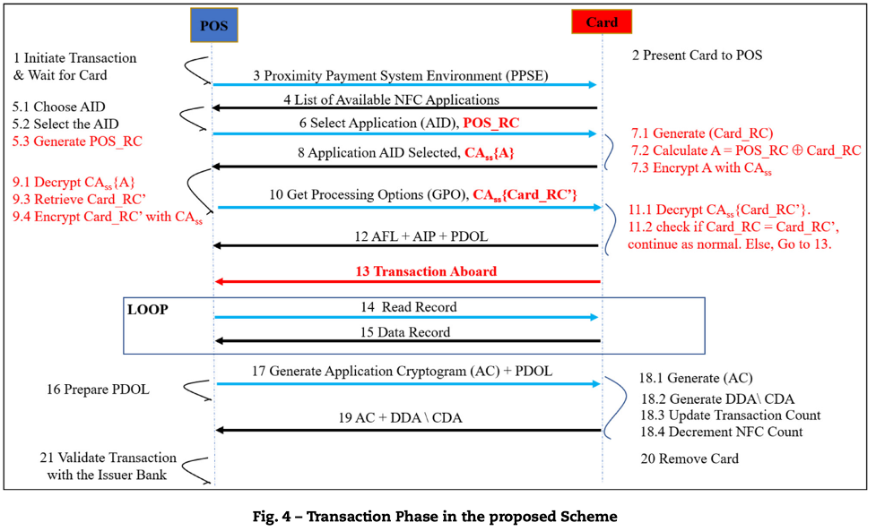

# Introduction

L’article propose d’intégrer une implémentation additionnelle aux protocoles existants (EMV, NFC…) dédiés à la communication entre le terminal de paiement et la carte EMV dans le mode `contactless`, pour éviter que la puce communique ses informations sensitives à des readers non autorisés.

# Vulnérabilité

En effet, la norme EMV impose l'authentification de la carte, pour garantir son unicité et qu’elle n’est pas clonée, au terminal de paiement à chaque transaction, mais le problème c’est que l’opération inverse ne se produit pas.

Un attaquant peut profiter de cette vulnérabilité dans la spécification EMV dans le mode sans contact pour établir une connectivité non autorisée à la carte à l’aide des readers ou des smartphones compatibles NFC et finir par avoir l’accès aux données sensitives sur cette carte. (sniffing attacks)

# Proposition de la solution

Comme déjà mentionné, cette attaque est possible parce-que l’authentification est unilatérale (carte s’authentifie au terminal seulement mais pas dans le sens contraire), et donc la solution comme cité sur le titre est : « mutual authentication protocol », l’article traite surtout à comment la carte peut authentifier un terminal avant de le transmettre toute information sensible (le cryptogramme généré, SI…).

L’article propose que l’intégration de ces modifications mineures sur l’infrastructure EMV soient implémentés lors de la phase de personnalisation des cartes et lors de la transaction, il traite aussi les différents modes d’authentification et c’est dans ce sens qu’on veut présenter dans un premier temps ces concepts et identifier le contexte général de l’article :
Personnalisation de carte
C’est la phase la plus importante dans le cycle de vie de la carte, puisqu’il s’agit de l’étape qui répond à la question de comment les données sont représentées sur la carte, (signature numérique des informations statiques.
La banque précédemment a déjà fait une commande pour recevoir des cartes vierges auprès d’un fabricateur des cartes,
Une fois qu’un client demande sa carte, sa banque (Émettrice de la carte/Card Issuer) envoie un fichier de personnalisation à une nouvelle entité qui s’appelait « Bureau de personnalisation » sorte d’usine qui programme la puce, et imprime le nom du porteur et le numéro PAN (Primary Account Number) sur la carte vierge et le renvoie à la banque ou au client. (Au Maroc par exemple : S2M – Centre de personnalisation Bouskoura).

## NB :

L’article n’a pas mentionné que cette phase fait partie de la Card Production, et doit être conforme aux normes PCI CP (Payment Card Industry Card Production) qui sont une sorte de liste des règles physiques et logique qui s’appliquent à toutes les entités sur le schéma au-dessous, par exemple le bureau de personnalisation ne doit jamais envoyer la carte et son PIN au même temps, le PIN doit être renvoyé après quelque jours…

# Mode d’authentification de carte

On a déjà mentionné que la carte s’authentifie au terminal, les spécifications EMV en général prennent en charge trois méthodes d'authentification, toutefois le concept en commun derrière est que la carte EMV génère une signature numérique unique pour s'authentifier et seulement son émetteur (la banque qui a émis la carte au porteur) pourra la valider.

## NB : c’est pourquoi il n’est pas possible de cloner une carte EMV, le secret ne quitte jamais la puce.

Ces trois méthodes d'authentification sont :

### 1. Authentification statique des données (SDA : Static Data Authentication)

Génération d’une signature numérique contenant des informations statiques (SI) de la carte EMV comme le PAN, nom du porteur et date d'expiration.
Ces données sont signées par la clé privée RSA de la banque émettrice (IBsk) – Issuer Bank Secret Key et puis envoyé de la carte au point de vente afin d'être vérifié.

### 2. Authentification dynamique des données (DDA : Dynamic Data Authentication)

Génération de deux signatures numériques constituées de la même première signature numérique SDA avec une autre qui contient certaines données liées à la transaction en cours telles que le montant, la date et l’heure, et la devise mais cette fois signés par la clé privée RSA de la carte elle-même (Csk) – Card Secret Key.
Ces deux signatures numériques sont envoyées au terminal.

### 3. Authentification combinée des données (CDA : Combine Data Authentication).

La carte EMV comprend l'Application Cryptogramme (AC) à la deuxième signature numérique utilisée dans le DDA puis ces deux signatures sont envoyées au POS / ATM pour vérifier que la carte EMV est authentique.

#### NB : La carte est programmée à identifier le risque suite aux capacités de terminal, TPE ou ATM, environnements et protocoles supportées, mode de la transaction… puis s’authentifie en choisissant une de ces trois méthodes.

L’article fait appel à cette figure pour illustrer ces 3 méthodes au dessous:

Nouvelles notions : RSA, clé publique, clé privé, signature numérique, cryptage, certificate authority CA…

Avant qu’on puisse avancer, il faut savoir beaucoup des principes autour de la sécurité, donc j’ai essayé de m’arrêter sur certaines notions :

## Encrypting/Chiffement VS Signature

### 1. Lors du chiffrement (encrypting), nous utilisons leur clé publique pour écrire un message et ils utilisent leur clé privée pour le lire.

### 2. Lors de la signature (signing), nous utilisons notre clé privée pour écrire la signature du message, et ils utilisent notre clé publique pour vérifier si elle est vraiment la nôtre.

Situer l’état de recherche et critiquer les solutions déjà proposées dans des différents articles, montrer leurs faiblesses :

Les auteurs de l’article cherchent à montrer les faiblesses des solutions proposés auparavant et citent leurs défauts,

Proposition 1 : Bouton d'activation pour permettre la lecture de la carte au moment de la transaction sans contact.

> Changement majeur sur la carte, incompatibilité sur les cartes déjà émis…

Proposition 2 : Solution pareils

> Excès APDU commands…

Maintenant, pour une transaction contacless ayant une limite assez basse (600 dhs au Maroc), il faut savoir que le but est de fluidifier cette transaction (rapidité), et contribuer à une meilleure expérience client et ce par réduire les files d'attente aux caisses, et même si des problèmes de sécurité sont se présentent (Non saisi du PIN, Skimming), il faut penser absolument à la phase d’autorisation qui doit être de plus en plus courte pour rassurer cette rapidité et cette fluidité, toutefois rajouter un protocole d’authentification, de nouvelles vérifications va affecter le temps pris par cette autorisation, ce point critique est analysé aussi sur l’article.
Trouver une combinaison de sécurité, rapidité et faisabilité est la clé pour cette problématique.
Revenant aux intégrations à rajouter lors de la phase de personnalisation et la distribution des clés

Phases de personnalisation de la carte & distribution des clés

L’article commence par décrire la phase de personnalisation de carte et par la distribution des clés comme exigé par la norme EMV et finit par proposer de rajouter une clé secrète ou privée partagée afin de procéder à une authentification mutuelle et toujours pour minimiser les changements dans les infrastructures EMV, indiquera qu’il faut que la carte EMV et les POS soient téléchargées avec le même CAss (Certificate Authority Shared Secret) à la fin de la distribution des clés.

Et puis indique les phases à rajouter lors du déroulement de la transaction :

Les parties restantes sont des implémentations très techniques NFC protocole + des résultats…

--

Améliorer et traiter les sujets :

Sécurité, cryptage asymétrique/symétrique, RSA, NFC, APDU commands…

Voir les intersections avec la norme Card Production.
